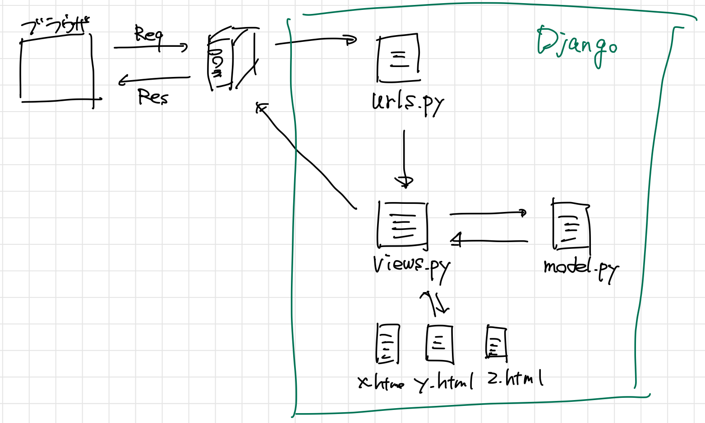

# Django
## Djangoのイメージ

## startprojectとは？
- さまざまなファイルを持ってくるイメージ
  ```bash
  # 新しいフォルダをプロジェクト名で作成し、さらに小フォルダも同名で作成
  $ django-admin startproject {プロジェクト名}
  # 新しいフォルダを作成し、その中にurls.pyを直接作成
  $ django-admin startproject {プロジェクト名} .
  ```
- 下記のようなディレクトリが作成される
  ```
  ├── helloworldproject
  │   ├── helloworldproject
  │   │   ├── __init__.py
  │   │   ├── asgi.py
  │   │   ├── settings.py
  │   │   ├── urls.py
  │   │   └── wsgi.py
  │   └── manage.py
  ```
- サーバーを起動
  ```bash
  # debug環境で起動
  python manage.py runserver
  #  http://127.0.0.1:8000/に接続
  # IPアドレスを指定して起動
  python manage.py runserver {IPアドレス}
  ```

### startprojectでできるファイル
- `manage.py`
  様々な機能をこのスクリプトを通して実行できる
- `db.sqlite3`
  データベース
- `__init__.py`
  pythonパッケージであることを認識させることができる
- `asgi.py`
  今後に向けてファイルができているだけで、現状は使わない
- `wsgi.py`
  web server gateway interfaceの略
  webサーバーとpythonの間を取り次ぐツールを規定しているもの
- `setting.py`
  Djangoの設定を実施するファイル
- `urls.py`
  webサーバから何らかのリクエストを受け取った際にはじめに受け取る場所

### アプリの作成
```bash
$ python manage.py startup {アプリ名}
# python manage.py startup helloworldapp
```

- models.py
  - データベースとの橋渡しをしている
  - makemigrations : 設計図を作る
  - migrate : データベースに反映する

### djangoのテンプレートとCRUD
- C Create (作成する)
  - CreateView
  - データの一覧をリストとして表示することに適したテンプレート
- R Read (読み込む【情報を取る】)
  - ListView, DetailView
  - データの中身を表示することに適したテンプレート
- U Update (更新する)
  - UpdateView
- D Delete (削除する)
  - DeleteView

### ListView
タグを使った記載ができる
- Django
  - `` : 複雑な処理(for文、条件分岐など)
  - `{{ }}` : データ
- html
  - `< >` : タグ

### base.html
- base.htmlを使ってテンプレートを使い回す
- 違うhtmlのファイルを当てはめていく